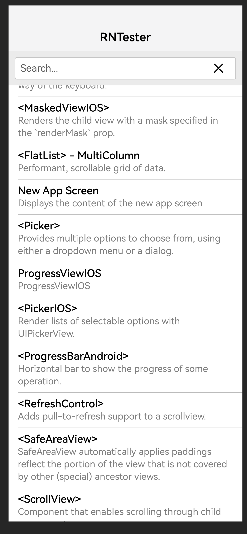

1. **61版本适配是在 77 的基础上打的补丁，所以node 大版本保持22**
2. 共提供 4 个依赖包，分别在 harmony 和 rnoh-entry 两个工程的 libs 目录下：

* react_native_harmony_61_interop.har
* react_native_openharmony.har

两个 har 包用于原生工程。

* react-native-oh-react-native-harmony-0.77.25.tgz
* react-native-oh-react-native-harmony-61-interop-0.0.0.tgz

* react-native-oh-react-native-harmony-cli-0.77.25.tgz

三个 tgz 包用于前端工程

3. 提供了 demo 工程实例，参考搭建，其中harmony为原生工程，rnoh-entry为前端工程
   3.1 前端工程执行 npm i --f，依赖安装成功后执行npm run dev
   3.2 原生工程执行 ohpm install，然后 run

Demo界面展示一般如下所示：

[]
